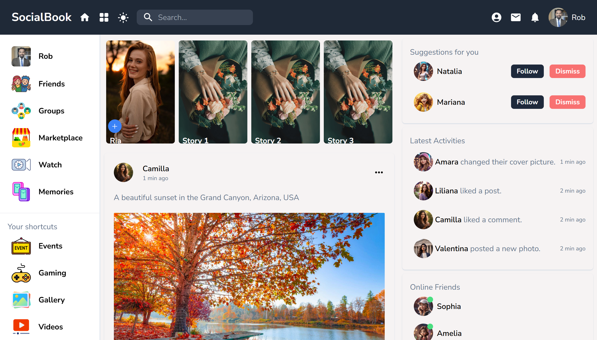

# SocialBook App

SocialBook is a social networking application that allows users to connect, share updates, and interact with each other through posts, comments, and likes. This project aims to provide a simple yet robust platform for social interactions.

## Features

- **User Authentication**: Sign up, log in, and manage user accounts.
- **User Profiles**: Create and edit personal profiles.
- **Posts**: Create, edit, and delete posts.
- **Comments**: Add comments to posts.
- **Likes**: Like and unlike posts.
- **News Feed**: View a feed of posts from all users.
- **Notifications**: Receive notifications for likes and comments on your posts.

## Technologies Used

- Frontend:

  - React.js
  - Redux
  - Tailwind CSS
- Backend:

  - Node.js
  - Express.js
  - MongoDB

## Installation

To run this project locally, follow these steps:

- Clone the repository:

   ```bash
   git clone https://github.com/Chandan-devs-tech/socialbook-app.git
    ```
 - Navigate to the project folder:
  
    ```sh
        cd urban-seller
    ```

- Install the project dependencies:
  
  ```sh
    npm install
  ```

- Create a `.env` file in the root directory and add the following environment variables:
  
  ```sh
    NODE_ENV = development
    PORT = 5000
    MONGO_URI = your_mongodb_uri
    JWT_SECRET = 'your_secret'
    PAYPAL_CLIENT_ID = your_paypal_client_id
  ```

- Run the project:
  
  ```sh
    npm run dev
  ```


